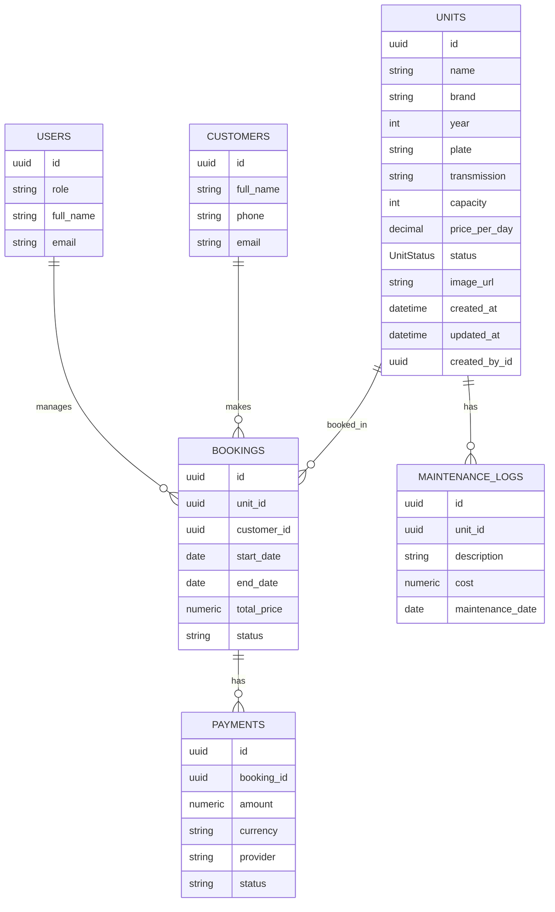

# Database Schema (ERD)

This document outlines the database structure for **RentHub**, providing a reference for the entities, their attributes, and the relationships between them.

## Entity Relationship Diagram

---

## Data Dictionary

### 1. `USERS`

Stores internal users (administrators, staff) who manage the system and bookings.

- `id`: Unique identifier (UUID).
- `role`: User role (e.g., 'admin', 'staff').
- `full_name`: User's display name.
- `email`: User's contact and login email.

### 2. `UNITS`

Represents the rental vehicles/units available in the fleet.

- `id`: Unique identifier (UUID).
- `name`: Vehicle name (e.g., "Toyota Hiace").
- `brand`: Manufacturer (e.g., "Toyota").
- `year`: Manufacturing year (e.g., 2024).
- `plate`: License plate number (Unique).
- `transmission`: 'Automatic' or 'Manual'.
- `capacity`: Maximum number of passengers.
- `price_per_day`: Daily rental rate.
- `status`: Current availability (`AVAILABLE`, `RENTED`, `MAINTENANCE`).
- `image_url`: Link to the unit's photo.
- `created_at`: Timestamp of record creation.
- `updated_at`: Timestamp of last update.
- `created_by_id`: Reference to the user who created the unit.

### 3. `CUSTOMERS`

Stores information about the clients making bookings.

- `id`: Unique identifier (UUID).
- `full_name`: Customer's full name.
- `phone`: Contact phone number.
- `email`: Contact email address.

### 4. `BOOKINGS`

The core transactional table linking units, customers, and managers.

- `id`: Unique identifier (UUID).
- `unit_id`: Foreign Key referencing `UNITS`.
- `customer_id`: Foreign Key referencing `CUSTOMERS`.
- `start_date`: Beginning of the rental period.
- `end_date`: End of the rental period.
- `total_price`: Calculated total cost for the duration.
- `status`: Booking status (e.g., 'Pending', 'Confirmed', 'Completed', 'Cancelled').

### 5. `PAYMENTS`

Handles financial records associated with bookings.

- `id`: Unique identifier (UUID).
- `booking_id`: Foreign Key referencing `BOOKINGS`.
- `amount`: Paid amount.
- `currency`: Currency code (e.g., 'PHP', 'USD').
- `provider`: Payment gateway or method (e.g., 'Stripe', 'Cash').
- `status`: Payment status (e.g., 'Succeeded', 'Pending', 'Failed').

### 6. `MAINTENANCE_LOGS`

Tracks service history and costs for units.

- `id`: Unique identifier (UUID).
- `unit_id`: Foreign Key referencing `UNITS`.
- `description`: Details of the maintenance work performed.
- `cost`: Cost of the maintenance.
- `maintenance_date`: Date the work was recorded.

---

## Relationship Summary

- **Units - Bookings**: One unit can have many bookings over time (1:N).
- **Customers - Bookings**: One customer can make multiple bookings (1:N).
- **Bookings - Payments**: One booking can result in one or more payment attempts/records (1:N).
- **Units - Maintenance**: One unit tracks multiple maintenance events for health monitoring (1:N).
- **Users - Bookings**: Administrative users manage many bookings (1:N).
